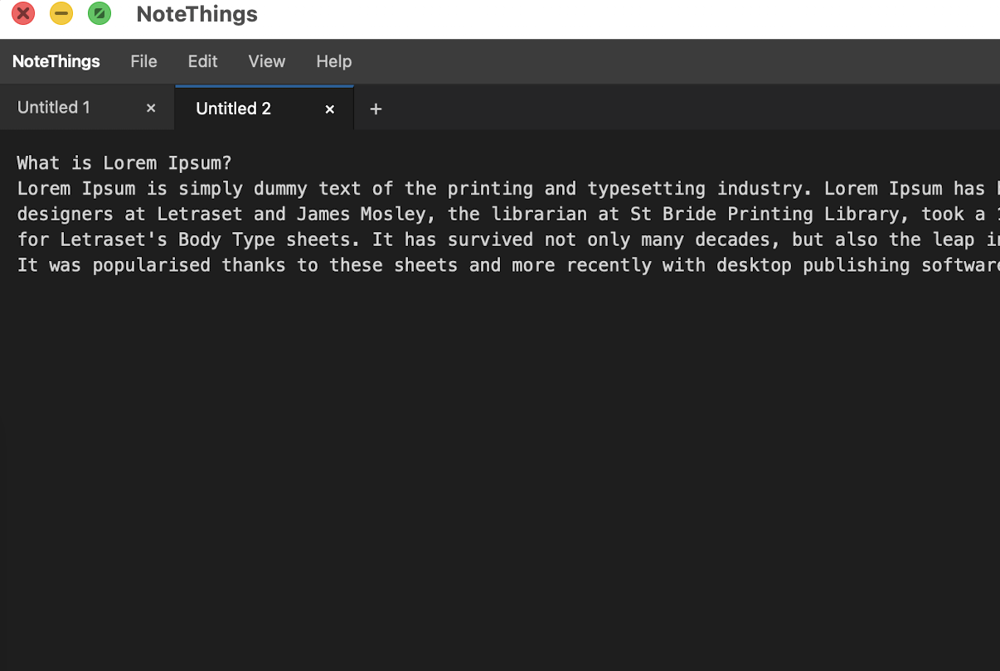

# NoteThings

A cross-platform text editor inspired by Notepad++ and Windows Notepad, built with **.NET MAUI Blazor Hybrid**, targeting **macOS** and **Windows**.



## Features

- **Tabbed editing** — open multiple notes simultaneously, each in its own tab
- **JSON & XML support**
  - Syntax highlighting with colour-coded tokens for easy reading
  - Auto-format / pretty-print JSON and XML content with one click
- **File operations**
  - Save tab content as a text file or other supported formats
  - Prompted to save unsaved changes before closing a tab
- **Clipboard** — full cut, copy, and paste support

## Tech Stack

- **.NET 10** — latest SDK
- **C# 14** — latest language features
- **.NET MAUI** — native shell, windowing, and platform integration
- **Blazor Hybrid** — UI rendered via `BlazorWebView` inside a MAUI app
- **Tailwind CSS** — utility-first styling for a custom desktop look and feel
- **Plain `<textarea>`** — current editor; a richer editor (CodeMirror 6 / Monaco) is planned but requires a real JS bundler (npm + esbuild). Tracked for a future iteration.
- **Target platforms**: macOS (Mac Catalyst) and Windows

## Project Structure

```
NoteThings/
├── Components/         # Blazor components (pages, layouts)
├── Platforms/          # Platform-specific entry points (MacCatalyst, Windows)
├── Resources/          # Icons, fonts, images, splash
├── wwwroot/            # Static web assets (CSS, JS)
├── MauiProgram.cs      # App bootstrap and DI setup
├── MainPage.xaml       # MAUI host page containing BlazorWebView
└── NoteThings.csproj   # Multi-target project file
```

## Getting Started

### Prerequisites

- [.NET 10 SDK](https://dotnet.microsoft.com/download/dotnet/10.0)
- Visual Studio 2022 / Visual Studio Code with C# Dev Kit
- Xcode (for macOS builds)

### Build & Run

```sh
# macOS
dotnet build -f net10.0-maccatalyst

# Windows
dotnet build -f net10.0-windows10.0.19041.0
```

## Contributing

Feel free to open issues or submit pull requests.

## License

MIT
